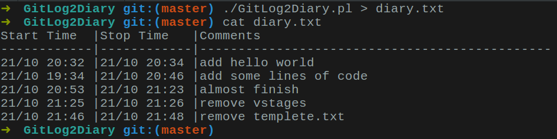

# GitLog2Diary

## Description

A script to generate diary from git log, this is required by COMP9041 assignment 2 in 2018S2.

>Andrew wrote: Some students choose to store this information in git commit messages and use a script to generate diary.txt from git log before they submit. You are welcome to do this. 

## Git Commit Message Format

**Important: to generate start time, git commit message must follow a special format**

**重要：为了生成开始时间，git commit 内容必须遵循特定格式**

```shell
git commit -m "01:30 your commit message"
```
- [01:30]: The hours and minutes used for this commit, a white space is followed.

## Full Usage Documentation

```shell
./GitLog2Diary.pl ["Author"] [> diary.txt]
```

- [Author]: specify an author. If omitted, all author will be matched.
- [> diary.txt]: output as a text file. If omitted, just print out the diary.

## Example



some entry do not have start time, because their git commit message do not follow the format.